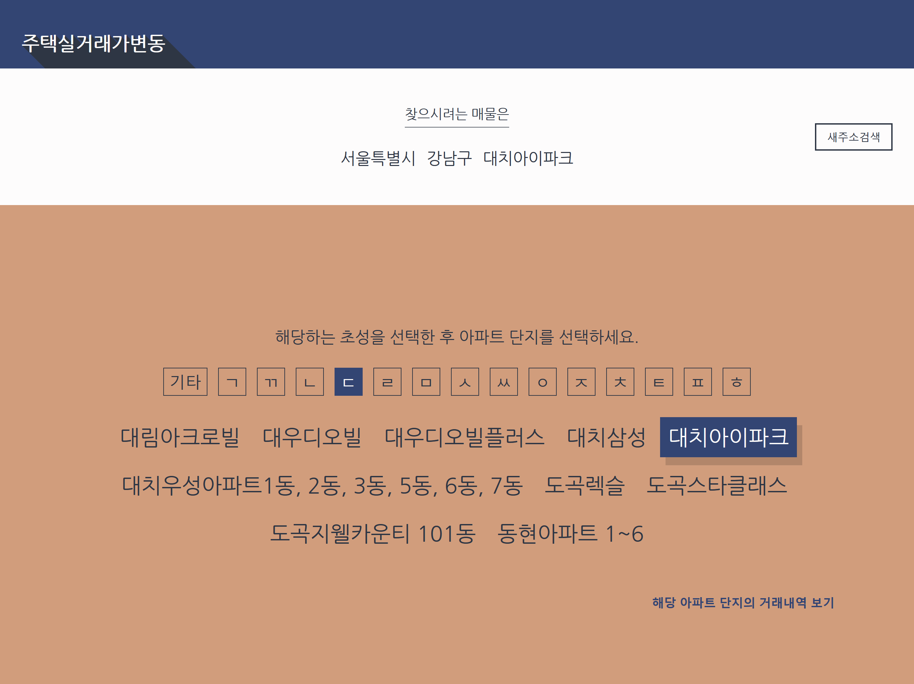
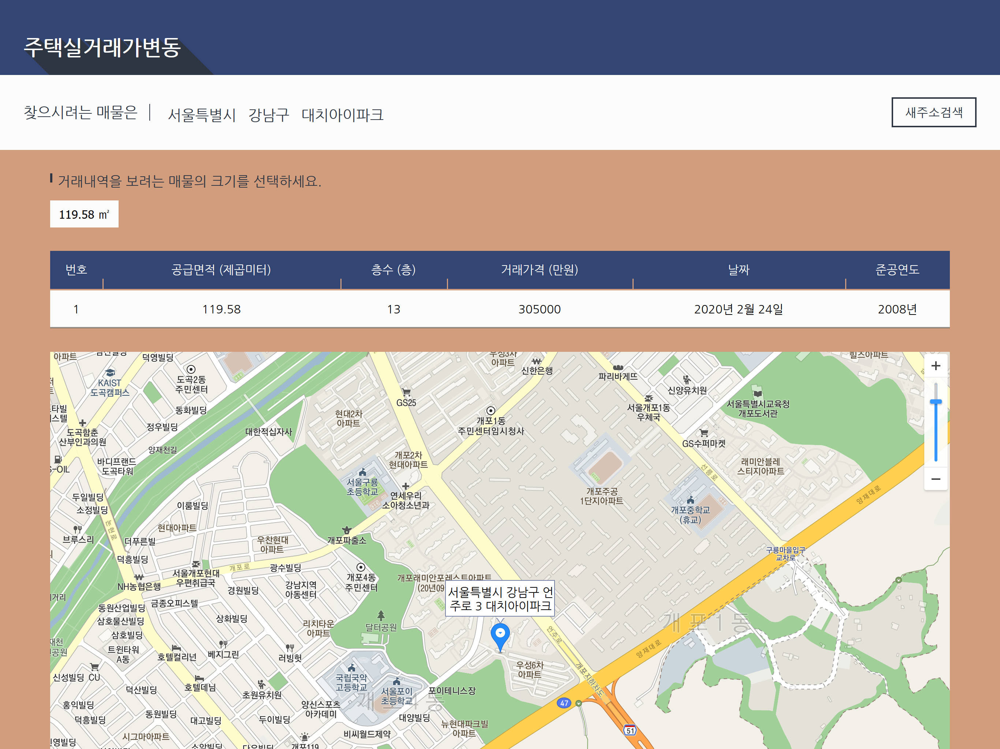

# Get Realty






## Introduction

- 이 웹앱은 2020년 2월 한 달 동안의 전국 아파트 매물의 실거래가 내역을 보여줍니다.
- React JS 를 사용하여 개발하였습니다.
- 실거래가 내역은 [데이터 1번가](https://www.data.go.kr/tcs/dos/selectDataOneStListView.do) 에서 제공하는 거래내역을 csv로 내려받아 활용하였습니다.
- csv 파일의 내용을 API로 제공하는 서버는 [Renee Beom](https://github.com/sean-poem)이 작업한 [](https://github.com/sean-poem/realestateprj1)을 활용하였습니다.
- 지도는 [카카오 지도 API](https://apis.map.kakao.com/web/)를 사용하였습니다.


## Development Milestones

#### React JS 
- 본 웹앱은 ReactJS를 활용하여 SPA(Single Page Application) 개발을 시작하기 알맞은 환경을 제공하는 [Create React App](https://github.com/facebook/create-react-app)로 제작되었습니다.
- Functional component 로 구성: 코드 간소화 및 가독성 증대
- Hooks 사용: class based component가 아니어도 state, lifecycle 등을 활용가능케 하고 useEffect, useState, useContext 가 이에 해당
- React Router: browser router, link, switch, route 모듈 활용
- Context API: 앱의 전체적으로 사용되는 state 운용을 가능케 함
- Conditional rendering
- List 생성시 key 속성의 활용

#### ECMAscript (ES6이상)
- 함수 표현식의 경우 arrow function의 활용
- Higher order function 으로서 map, find 등의 Array method 활용
- 객체 및 배열 표현에 있어 Destructuring 을 활용
- string 과 표현식과의 혼합 사용을 template literals 활용

#### React Router
- SPA 서비스를 가능케 하는 router 기능 활용
- path 속성 매칭과 활용 유의점

#### Kakao map API
- 찾으려는 매물의 주소를 활용하여 지도 상 위치와 주변정보를 전달하기 위함
- 지도API 가 포함된 MapBox.js 파일의 경우 Kakao Map 문서에 나타난 코드를 그대로 이용한 후 개발상 값 입력이 요구되는 부분을 작업


## Getting started

#### Preparation

다음 버전의 소프트웨어가 설치된 상태에서 테스트 되었습니다.

- Git 2.21.0.windows.1
- Node.js 10.16.3 and npm 6.11.3

#### Running Server

저장소를 개발환경에 복제한 후 다음의 디펜던시를 설치한다:

```
npm ci
```
개발환경에서 앱을 구동하기 위해 다음을 입력한다:
```
npm start
```
브라우저의 주소창에 [http://localhost:3000](http://localhost:3000)을 입력한다.


## UX Test

- 해당하는 매물을 검색하기 위하여 시·도를 선택합니다.
- 시·도내에 위치한 구·군 중 선택합니다.
- 구·군내에 위치한 아파트 단지의 초성을 선택합니다.
- 해당하는 아파트 단지를 선택 후 `거래내역 보기` 버튼을 클릭합니다.


## Development Environments

- IDE: Visual Studio Code
- Version Control System: GIT
- Browser: Version 1.9.72 Chromium: 81.0.4044.138 (Official Build) (64-bit)


## Roadmap

- [ ] 2020년 2월 이전의 거래내역 추가
- [ ] 거래내역의 그래프 이용한 시각화 UI 추가
- [ ] 공시지가 변동 내역 추가
- [ ] 공시지가 변동 그래프 추가
- [ ] 코드 리팩토링
- [ ] Live Demo 추가# get-realty
